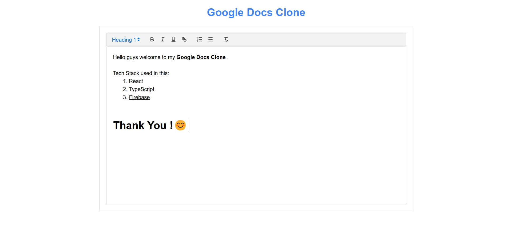

# Real-Time Collaborative Text Editor with React & Firebase

Welcome to the **Real-Time Collaborative Text Editor** project! This editor, styled like Google Docs, allows multiple users to edit a document simultaneously with live updates. Built using **React**, **Firebase**, and **React Quill**, this project demonstrates key features such as real-time synchronization and optimized database interactions.

### Project Overview

This project is a collaborative text editor inspired by Google Docs. Users can edit documents in real-time, and changes are immediately synced across all connected clients. By leveraging Firebase Firestore for real-time updates, we achieve both smooth interactions and minimal database usage.

### Features

- **Real-Time Collaboration**: Multiple users can edit the same document, with each change appearing in real-time.
- **Firebase Firestore Integration**: Document changes are stored and synchronized using Firestore’s real-time database.
- **Google Docs-Like UI**: An intuitive, Google Docs-inspired UI for a familiar editing experience.

### Installation

To set up the project locally, follow these steps:

1. **Clone the repository**:
    ```
    git clone https://github.com/SharmaSanchay/Docs.git
    cd Docs
    ```

2. **Install dependencies**:
    ```
    npm install
    ```

3. **Set up Firebase**:
   - Create a new Firebase project at [Firebase Console](https://console.firebase.google.com/).
   - Add a Firestore database to your project and configure your `firebase-config.js` with the Firebase credentials.

4. **Run the app**:
    ```
    npm run dev
    ```



<h2>Happy coding!</h2>
